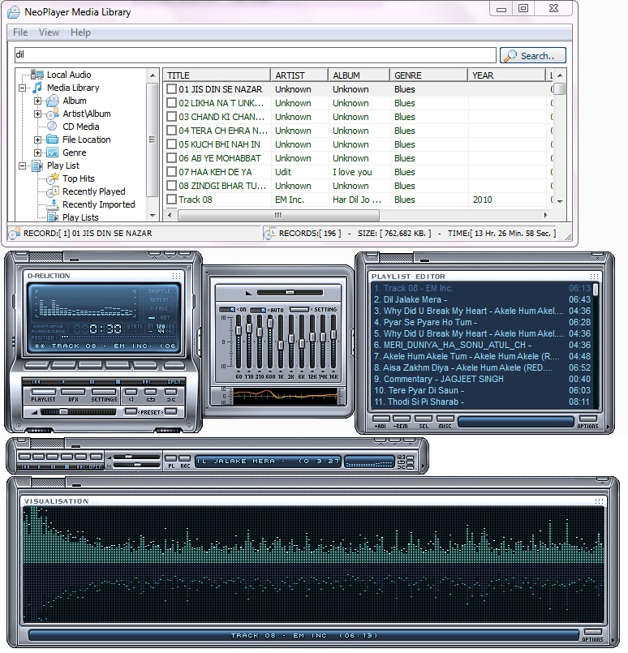



## MP3 Library \+ TagEditor

### Description

Must Watch Application: Mp3 library cum TagEditor

Manage Mp3 songs in your system in its highly advanced and user friendly library and allows user to edit Mp3 tags even through Data retrieval from internet. It is just trailer of my Mp3player

I am working on.
 
### More Info
 

             |
---                |---
**Submitted On**   |2010-10-14 13:47:06
**By**             |[mahesh Kurmi](https://github.com/Planet-Source-Code/PSCIndex/blob/master/ByAuthor/mahesh-kurmi.md)
**Level**          |Advanced
**User Rating**    |5.0 (40 globes from 8 users)
**Compatibility**  |VB 6\.0
**Category**       |[Sound/MP3](https://github.com/Planet-Source-Code/PSCIndex/blob/master/ByCategory/sound-mp3__1-45.md)
**World**          |[Visual Basic](https://github.com/Planet-Source-Code/PSCIndex/blob/master/ByWorld/visual-basic.md)
**Archive File**   |[MP3\_Librar21906110152010\.zip](https://github.com/Planet-Source-Code/mahesh-kurmi-mp3-library-tageditor__1-73531/archive/master.zip)

